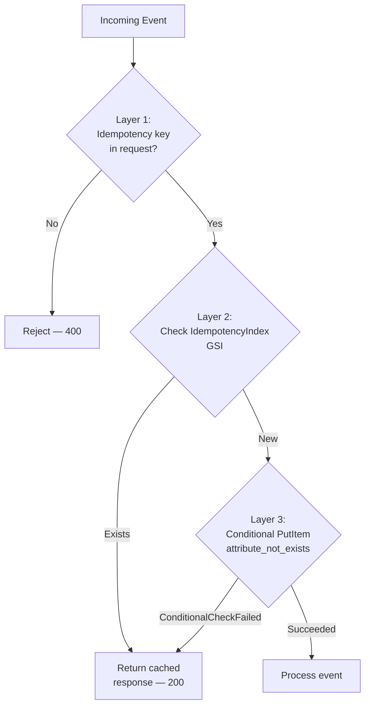
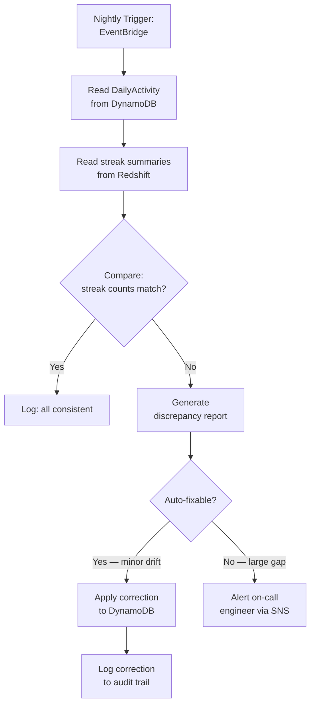
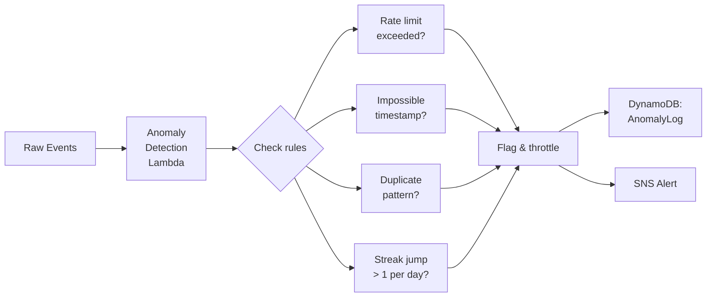

# 3. Data Integrity & Anomaly Detection

## Why Data Integrity Matters

Streaks are a **trust contract** with users. If a user loses a streak due to a system bug, they lose engagement and trust. If a user exploits a bug to inflate their streak, the gamification loses meaning. Both failure modes are unacceptable.

---

## Deduplication Strategy

### The Problem

Duplicate events arise from:

- **Client retries** — mobile apps retry on network timeouts, sending the same event twice
- **Lambda retries** — AWS Lambda retries on failure (at-least-once delivery)
- **DynamoDB Streams replay** — stream events can be delivered more than once

### Multi-Layer Dedup



#### Layer 1 — Client-Side Idempotency Key

The mobile app generates a deterministic key per event:

```
idempotency_key = f"{user_id}:{event_type}:{client_timestamp}"
```

Same user + same event type + same timestamp = same key. Retries produce the same key and are caught.

#### Layer 2 — GSI Lookup

Before writing, the Lambda queries the `IdempotencyIndex` GSI on the `BPEvents` table. If the key exists, the event is a duplicate — return the original response.

#### Layer 3 — Conditional Write

Even if the GSI check passes (eventual consistency window), the `PutItem` uses:

```python
table.put_item(
    Item=event,
    ConditionExpression="attribute_not_exists(idempotency_key)"
)
```

This is **strongly consistent** and prevents the race condition where two Lambda invocations both pass the GSI check.

#### Stream Processing Dedup

The streak processor Lambda stores processed event IDs in a short-lived Redis set:

```python
if redis_client.sismember(f"processed:{user_id}", event_id):
    return  # Already processed

# ... process streak logic ...

redis_client.sadd(f"processed:{user_id}", event_id)
redis_client.expire(f"processed:{user_id}", 3600)  # 1-hour TTL
```

---

## Consistency Validation

### Nightly Reconciliation Job

A scheduled Glue job runs nightly to detect and fix inconsistencies between the operational and analytical layers.



**What gets reconciled:**

| Check | Source of Truth | Action |
|---|---|---|
| `current_streak` vs `DailyActivity` records | `DailyActivity` | Recompute streak from activity log |
| `total_bestie_points` vs sum of `BPEvents` | `BPEvents` | Recalculate and update |
| Missing `DailyActivity` records despite events | `BPEvents` | Backfill `DailyActivity` |
| Orphan `DailyActivity` without events | `BPEvents` | Flag for investigation |

### Cross-Layer Consistency

```sql
-- Redshift: find users where analytical data disagrees with operational
SELECT
    r.user_id,
    r.current_streak AS redshift_streak,
    o.current_streak AS dynamo_streak,
    ABS(r.current_streak - o.current_streak) AS drift
FROM analytics.user_streaks_snapshot r
JOIN staging.dynamo_user_streaks o
    ON r.user_id = o.user_id
WHERE r.current_streak != o.current_streak
ORDER BY drift DESC;
```

---

## Anomaly Detection

### Pattern-Based Detection



### Detection Rules

| Rule | Condition | Severity | Action |
|---|---|---|---|
| **Rate limiting** | > 100 events/user/hour | Medium | Throttle, don't award BP |
| **Impossible timestamps** | `client_timestamp` > 24h in the future or > 7 days in the past | High | Reject event |
| **Rapid timezone changes** | User timezone changes > 2x in 24h | High | Flag for review |
| **Streak jump** | `current_streak` increases by > 1 in a single update | Critical | Block update, alert |
| **Midnight exploit** | Activity at `23:59` in TZ1 then `00:01` in TZ2 | High | Use server-side TZ resolution |
| **BP spike** | Points earned in 1 hour > 10x user's daily average | Medium | Queue for review |

### Implementation: Rate Limiting with Token Bucket

```python
def check_rate_limit(user_id: str, redis_client) -> bool:
    """Token bucket rate limiter using Redis."""
    key = f"rate:{user_id}"
    current = redis_client.get(key)

    if current and int(current) >= 100:
        return False  # Rate limited

    pipe = redis_client.pipeline()
    pipe.incr(key)
    pipe.expire(key, 3600)  # Reset every hour
    pipe.execute()
    return True
```

### Implementation: Timezone Exploit Detection

```python
def detect_timezone_abuse(user_id: str, new_tz: str, dynamodb_table) -> bool:
    """Detect if a user is changing timezones to game the streak system."""
    response = dynamodb_table.get_item(Key={"user_id": user_id})
    user = response.get("Item", {})
    old_tz = user.get("timezone", new_tz)

    if old_tz == new_tz:
        return False

    # Check how many TZ changes in last 24h (stored as a list)
    tz_changes = user.get("recent_tz_changes", [])
    recent = [
        c for c in tz_changes
        if datetime.fromisoformat(c["timestamp"]) > datetime.now(UTC) - timedelta(hours=24)
    ]

    if len(recent) >= 2:
        return True  # Suspicious — flag for review

    return False
```

---

## Security Considerations

### Data Protection

| Layer | Control |
|---|---|
| **In transit** | TLS 1.3 on API Gateway; VPC endpoints for DynamoDB/S3 |
| **At rest** | AES-256 encryption (AWS-managed KMS keys) on DynamoDB, S3, and Redshift |
| **Access control** | IAM roles with least-privilege; no long-lived credentials |
| **API authentication** | Cognito JWT tokens validated at API Gateway |
| **PII handling** | `user_id` is an opaque UUID — no PII in the gamification tables |

### Audit Trail

Every mutation to streak data is logged:

```python
audit_table.put_item(Item={
    "audit_id": str(uuid4()),
    "user_id": user_id,
    "action": "STREAK_UPDATE",
    "old_value": {"current_streak": old_streak},
    "new_value": {"current_streak": new_streak},
    "trigger": "streak_processor_lambda",
    "timestamp": datetime.now(UTC).isoformat(),
    "ttl": int((datetime.now(UTC) + timedelta(days=365)).timestamp())
})
```

### Preventing Exploitation

1. **Server-side authority** — the server calculates dates and streaks; the client only sends raw events
2. **Conditional writes** — DynamoDB's `ConditionExpression` prevents concurrent overwrites
3. **Rate limiting** — prevents automated/bot interactions from inflating BP
4. **Anomaly alerts** — unusual patterns trigger investigation before rewards are granted

!!! info "Code Samples"
    - [`code-samples/lambda/event_ingestion.py`](https://github.com/MarksonMarcolino/gamification-data-pipeline/blob/main/code-samples/lambda/event_ingestion.py) — Includes validation and dedup logic
    - [`code-samples/glue/etl_job.py`](https://github.com/MarksonMarcolino/gamification-data-pipeline/blob/main/code-samples/glue/etl_job.py) — Includes batch deduplication
