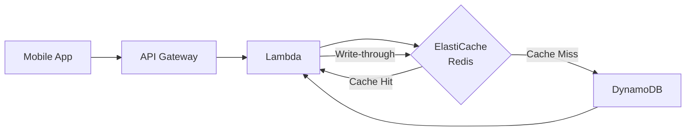
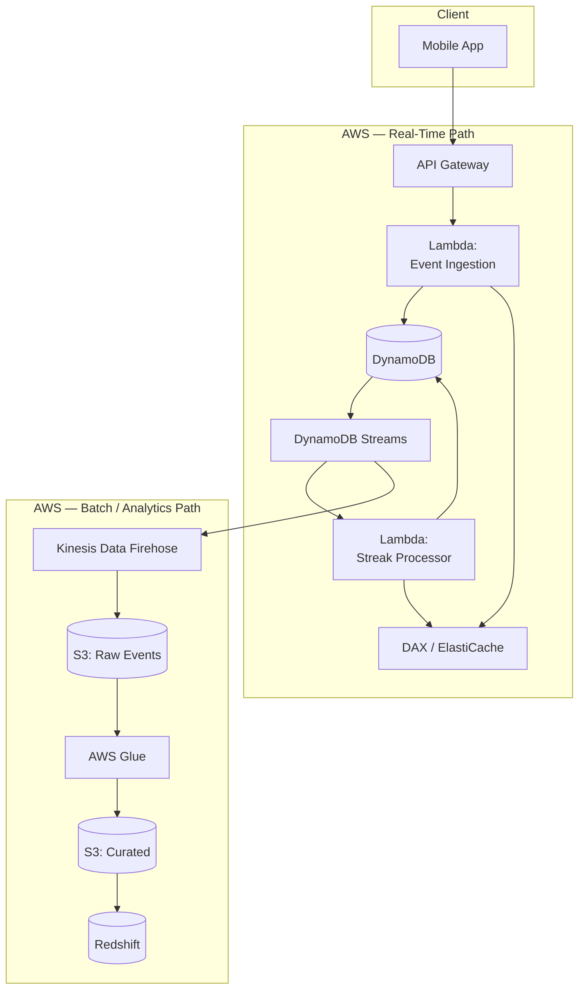

# 1. Data Modeling & System Design

## Database Choice: DynamoDB + Redshift Hybrid

The system uses a **dual-database architecture** — DynamoDB for the operational (OLTP) layer and Redshift for the analytical (OLAP) layer.

### Why DynamoDB for the Operational Layer

| Requirement | DynamoDB Capability |
|---|---|
| **Sub-10ms latency** | Single-digit millisecond reads/writes at any scale |
| **Automatic scaling** | On-demand capacity mode handles traffic spikes without provisioning |
| **Global reach** | Global Tables for multi-region replication (Luzia serves users worldwide) |
| **Conditional writes** | Built-in optimistic locking for streak consistency |
| **Event streaming** | DynamoDB Streams for change data capture (CDC) |

### Why Not a Relational Database?

A relational DB like Aurora would work for moderate scale, but DynamoDB is the stronger choice because:

- **No connection pooling bottleneck** — DynamoDB is HTTP-based, no connection limits
- **Horizontal scaling is automatic** — no read replicas to manage for read-heavy streak lookups
- **Cost model fits the pattern** — millions of small reads/writes are cheaper on DynamoDB on-demand than Aurora
- **Schema flexibility** — BP reward types can evolve without ALTER TABLE migrations

---

## Table Design

### Access Pattern Analysis

Before designing tables, identify the access patterns:

| Access Pattern | Operation | Frequency |
|---|---|---|
| Get user's current streak & BP | `GetItem` by `user_id` | Every app open (~millions/day) |
| Update streak on daily activity | `UpdateItem` conditional | Every unique daily activity |
| Record a BP-earning event | `PutItem` | Every interaction |
| Get user's BP history (last 30 days) | `Query` by `user_id` + date range | On profile view |
| Leaderboard: top streaks | `Query` GSI | Periodic / on-demand |
| Detect duplicate events | `GetItem` by idempotency key | Every incoming event |

### Entity Relationship Diagram

```mermaid
erDiagram
    USER_STREAKS {
        string user_id PK
        int current_streak
        int longest_streak
        string last_activity_date
        string timezone
        int total_bestie_points
        string updated_at
    }

    BP_EVENTS {
        string user_id PK
        string event_id SK
        string event_type
        int points_awarded
        string source
        string created_at
        string idempotency_key
        int ttl
    }

    DAILY_ACTIVITY {
        string user_id PK
        string activity_date SK
        string first_event_id
        int events_count
        int points_earned
        string created_at
    }

    USER_STREAKS ||--o{ BP_EVENTS : "earns"
    USER_STREAKS ||--o{ DAILY_ACTIVITY : "tracks"
```

---

### Table 1: `UserStreaks`

The **hot table** — queried on every app open to display the user's streak and BP balance.

| Attribute | Type | Key | Description |
|---|---|---|---|
| `user_id` | String | **PK** | Unique user identifier |
| `current_streak` | Number | | Consecutive days count |
| `longest_streak` | Number | | All-time max streak |
| `last_activity_date` | String | | `YYYY-MM-DD` in user's local TZ |
| `timezone` | String | | IANA timezone (e.g. `America/Sao_Paulo`) |
| `total_bestie_points` | Number | | Lifetime BP balance |
| `streak_updated_at` | String | | ISO 8601 timestamp |
| `version` | Number | | Optimistic locking counter |

**GSI: `StreakLeaderboard`**

| Key | Attribute |
|---|---|
| PK | `leaderboard_partition` (fixed value `"GLOBAL"` or regional shard) |
| SK | `current_streak` (sort descending) |

This GSI enables leaderboard queries. The partition key is sharded (e.g., by country) to avoid hot partitions.

### Table 2: `BPEvents`

Append-only event log for every point-earning interaction.

| Attribute | Type | Key | Description |
|---|---|---|---|
| `user_id` | String | **PK** | User identifier |
| `event_id` | String | **SK** | `{timestamp}#{uuid}` for sort order |
| `event_type` | String | | `CONVERSATION_START`, `TOOL_USE`, `DAILY_OPEN`, etc. |
| `points_awarded` | Number | | Points for this event |
| `source` | String | | `mobile_app`, `web`, `whatsapp` |
| `idempotency_key` | String | | Client-generated dedup key |
| `created_at` | String | | ISO 8601 |
| `ttl` | Number | | Epoch seconds — auto-delete after 90 days |

**GSI: `IdempotencyIndex`**

| Key | Attribute |
|---|---|
| PK | `idempotency_key` |

Enables O(1) duplicate detection before writing.

### Table 3: `DailyActivity`

One record per user per day — the source of truth for streak calculation.

| Attribute | Type | Key | Description |
|---|---|---|---|
| `user_id` | String | **PK** | User identifier |
| `activity_date` | String | **SK** | `YYYY-MM-DD` in user's local TZ |
| `first_event_id` | String | | Reference to the triggering event |
| `events_count` | Number | | Total interactions that day |
| `points_earned` | Number | | Total BP earned that day |
| `created_at` | String | | ISO 8601 |

---

## Performance Optimization

### Caching Strategy (ElastiCache Redis)



**What gets cached:**

| Data | Cache Key | TTL | Invalidation |
|---|---|---|---|
| User streak + BP | `streak:{user_id}` | 5 min | Write-through on update |
| Daily activity flag | `active:{user_id}:{date}` | 24h | None (immutable once set) |
| Leaderboard top 100 | `leaderboard:{region}` | 1 min | Scheduled refresh |

**Why write-through instead of write-behind:** streak data must be immediately consistent — a user updating their streak should see the new count instantly.

### DynamoDB Performance Tuning

1. **On-demand capacity mode** — no need to predict traffic; handles spikes automatically during push notifications or marketing campaigns
2. **DAX (DynamoDB Accelerator)** — alternative to Redis for microsecond reads; used if we want to avoid managing a Redis cluster. Trade-off: DAX only accelerates DynamoDB reads, while Redis can cache computed aggregates
3. **Partition key design** — `user_id` provides natural distribution across partitions (assuming UUIDs). No hot partition risk since each user's data is independent
4. **Item size optimization** — keep items small (<1 KB) for maximum throughput per partition

### Load Balancing

- **API Gateway** handles request distribution across Lambda functions automatically
- **Lambda concurrency** — set reserved concurrency per function to prevent one function from starving others
- **DynamoDB auto-scaling** (if using provisioned mode) — CloudWatch alarms trigger capacity increases before throttling occurs
- **Regional failover** — DynamoDB Global Tables + Route 53 health checks enable active-active multi-region

---

## System Architecture Overview



!!! info "Code Samples"
    See [`code-samples/dynamodb/table_definitions.py`](https://github.com/MarksonMarcolino/gamification-data-pipeline/blob/main/code-samples/dynamodb/table_definitions.py) for the full Boto3 implementation of these table designs.
