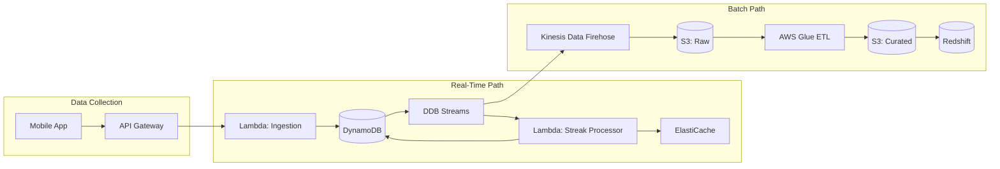
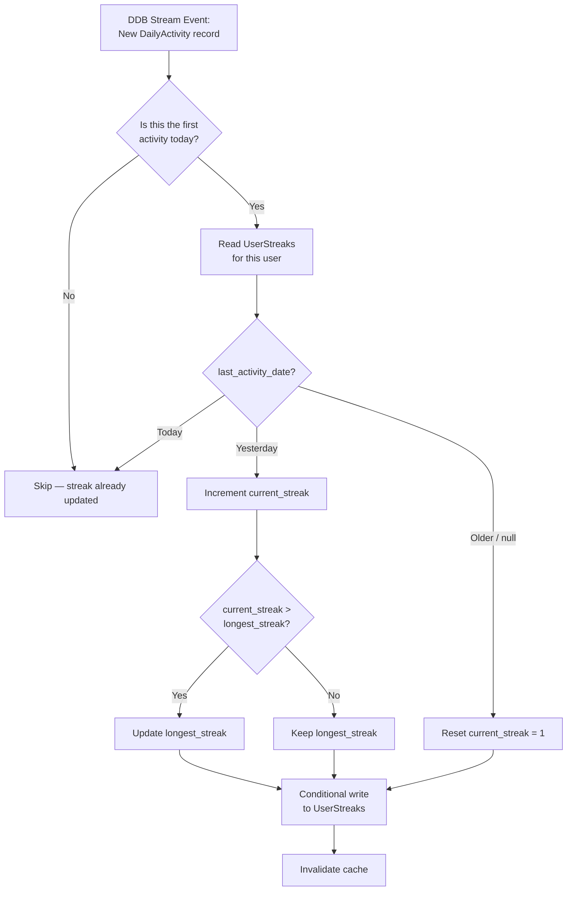
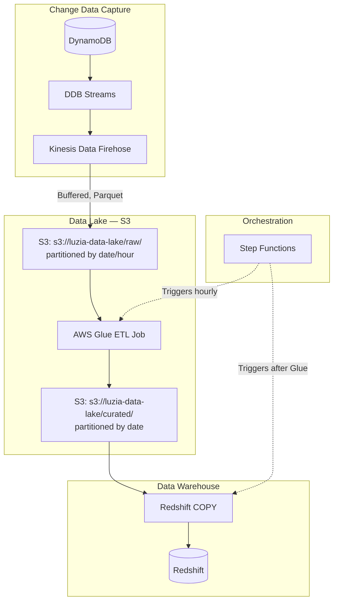
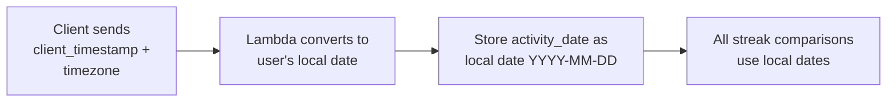
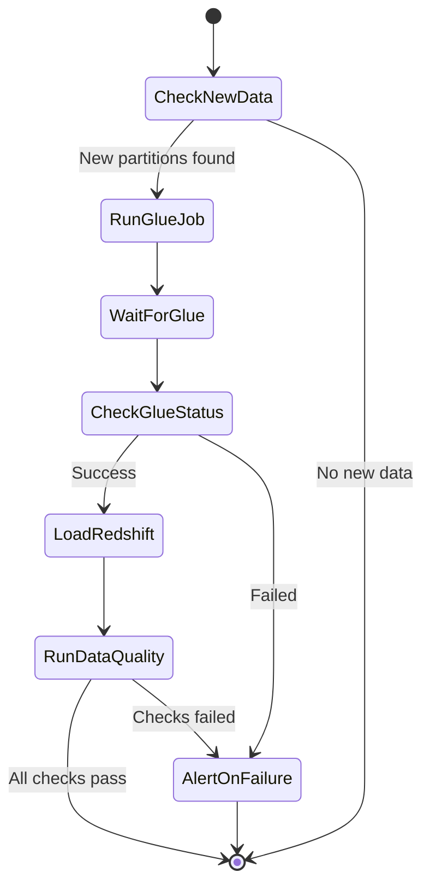

# 2. ETL & Data Pipeline Design

## End-to-End Architecture

The pipeline has two paths: a **real-time path** for instant user feedback and a **batch path** for analytics and reporting.



---

## Real-Time Path: Event Ingestion to Streak Update

### Step 1 — Event Ingestion (API Gateway → Lambda)

The mobile app sends events via REST API. Each event represents a user interaction.

```json
{
  "user_id": "usr_abc123",
  "event_type": "CONVERSATION_START",
  "client_timestamp": "2025-03-15T14:30:00-03:00",
  "timezone": "America/Sao_Paulo",
  "idempotency_key": "usr_abc123:CONV:2025-03-15T14:30:00",
  "source": "mobile_app",
  "metadata": {
    "app_version": "4.2.1",
    "device_os": "iOS 18.1"
  }
}
```

The **ingestion Lambda** performs:

1. **Validate** the payload (schema, required fields, timestamp sanity)
2. **Deduplicate** — check the `IdempotencyIndex` GSI on `BPEvents` table
3. **Normalize timestamp** — convert `client_timestamp` to UTC and to the user's local date
4. **Write** to `BPEvents` table with conditional put (fails if `idempotency_key` exists)
5. **Award points** — atomically increment `total_bestie_points` on `UserStreaks`

### Step 2 — Streak Processing (DynamoDB Streams → Lambda)

DynamoDB Streams triggers a Lambda on every write to `DailyActivity`. The **streak processor** Lambda:



**Key design decisions:**

- **Conditional writes** (`version` attribute) prevent race conditions when multiple events arrive simultaneously
- **Stream processing is idempotent** — if the Lambda retries, re-applying the same streak logic produces the same result
- The Lambda converts all dates to the **user's local timezone** before comparing

### Step 3 — Cache Update

After updating DynamoDB, the Lambda does a **write-through** to ElastiCache Redis:

```python
redis_client.setex(
    f"streak:{user_id}",
    ttl=300,  # 5 minutes
    value=json.dumps({
        "current_streak": new_streak,
        "total_bestie_points": new_bp,
        "longest_streak": longest
    })
)
```

---

## Batch Path: DynamoDB → S3 → Glue → Redshift

### Data Flow



### Kinesis Data Firehose Configuration

- **Source**: DynamoDB Streams (via Lambda fan-out) or direct Kinesis Data Streams
- **Buffer**: 5 minutes or 128 MB (whichever comes first)
- **Format conversion**: JSON → Parquet (using Glue Data Catalog schema)
- **S3 partitioning**: `s3://luzia-data-lake/raw/year=YYYY/month=MM/day=DD/hour=HH/`

### AWS Glue ETL Job

The Glue job runs hourly and performs:

1. **Deduplication** — remove duplicates using `idempotency_key` with window functions
2. **Schema enforcement** — validate and cast types against the Glue Data Catalog
3. **Enrichment** — join with user dimension data (timezone, country, signup date)
4. **Aggregation** — compute daily summaries per user
5. **Write** — output to curated S3 in Parquet, partitioned by date

```python
# Deduplication using PySpark window functions
window = Window.partitionBy("idempotency_key").orderBy(col("created_at").asc())
deduped = df.withColumn("row_num", row_number().over(window)) \
             .filter(col("row_num") == 1) \
             .drop("row_num")
```

### Redshift Loading

- **COPY command** from S3 curated layer (Parquet format, automatic schema mapping)
- **Incremental loads** — only process new partitions since last successful run
- **Schema**: see [Redshift DDL](https://github.com/MarksonMarcolino/gamification-data-pipeline/blob/main/code-samples/sql/redshift_schema.sql)

---

## Timezone Handling Strategy

Timezone correctness is critical because streaks depend on "one activity per **calendar day** in the user's local time."

### The Problem

A user in `America/Sao_Paulo` (UTC-3) interacts at `2025-03-15T23:30:00-03:00`. In UTC, that's `2025-03-16T02:30:00Z`. If we naively use UTC dates, this activity would count toward March 16th instead of March 15th — potentially breaking a streak.

### The Solution



**Rules:**

1. **The client always sends** `client_timestamp` (ISO 8601 with offset) and `timezone` (IANA)
2. **The server converts** to the user's local date using the `timezone` field — never trusts the client's date calculation
3. **`activity_date`** in `DailyActivity` is always in the user's local timezone
4. **`last_activity_date`** in `UserStreaks` is also in the user's local timezone
5. **UTC is the storage format** for all raw timestamps — local dates are derived, not stored as the primary timestamp

**Edge case — user changes timezone:**

- If a user travels from `America/Sao_Paulo` to `Europe/London`, their timezone in `UserStreaks` is updated
- The streak comparison uses the **new** timezone going forward
- Historical `DailyActivity` records retain their original local dates (immutable)

```python
from zoneinfo import ZoneInfo
from datetime import datetime

def get_local_date(utc_timestamp: str, timezone: str) -> str:
    """Convert UTC timestamp to local date string."""
    utc_dt = datetime.fromisoformat(utc_timestamp)
    local_dt = utc_dt.astimezone(ZoneInfo(timezone))
    return local_dt.strftime("%Y-%m-%d")
```

---

## Orchestration & Monitoring

### Step Functions Workflow



### Monitoring & Alerts

| Metric | Threshold | Action |
|---|---|---|
| Lambda error rate | > 1% | PagerDuty alert |
| Glue job duration | > 2x baseline | CloudWatch alarm |
| DDB throttled requests | > 0 | Auto-scale or alarm |
| Streak update lag | > 5 seconds | Investigate Streams |
| S3 partition gap | Missing hourly partition | Firehose health check |

!!! info "Code Samples"
    - [`code-samples/lambda/event_ingestion.py`](https://github.com/MarksonMarcolino/gamification-data-pipeline/blob/main/code-samples/lambda/event_ingestion.py) — Ingestion Lambda
    - [`code-samples/lambda/streak_processor.py`](https://github.com/MarksonMarcolino/gamification-data-pipeline/blob/main/code-samples/lambda/streak_processor.py) — Streak processor Lambda
    - [`code-samples/glue/etl_job.py`](https://github.com/MarksonMarcolino/gamification-data-pipeline/blob/main/code-samples/glue/etl_job.py) — Glue PySpark ETL job
