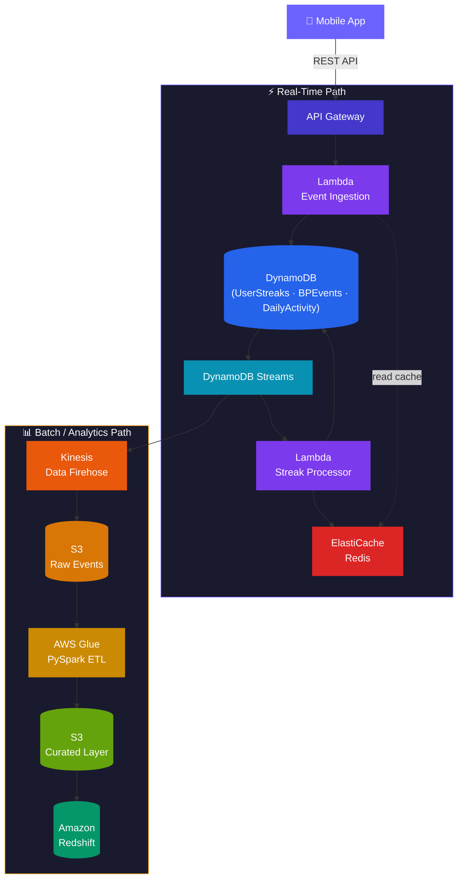

# Streaks & Bestie Points — Data Pipeline Design

## Overview

This document presents a **production-grade architecture** for Luzia's **Streaks & Bestie Points (BP)** gamification system. The system rewards millions of users worldwide for consistent daily engagement with the Luzia personal assistant app.

| Requirement | Solution |
|---|---|
| **Streak tracking** | Per-user daily activity detection with timezone-aware reset logic |
| **Bestie Points** | Event-driven point accrual from conversations and tool usage |
| **Scale** | Millions of DAU, global distribution, sub-100ms reads |
| **Real-time** | Instant streak/BP updates reflected in the mobile app |
| **Analytics** | Historical data warehouse for product and business intelligence |

---

## Tech Stack

---

## Design Document Sections

### [1. Data Modeling & System Design](data-modeling.md)
Database design, table schemas, DynamoDB access patterns, caching with ElastiCache, and performance optimization for peak-load scenarios.

### [2. ETL & Data Pipeline Design](etl-pipeline.md)
End-to-end pipeline from mobile events to the analytical data warehouse — real-time and batch paths, timezone handling, and data transformation.

### [3. Data Integrity & Anomaly Detection](data-integrity.md)
Idempotency, deduplication, consistency validation, anomaly detection, and security controls to keep streak data trustworthy.

---

## Code Samples

Working implementations are in the [`code-samples/`](https://github.com/MarksonMarcolino/gamification-data-pipeline/tree/main/code-samples) directory:

| File | Purpose |
|---|---|
| `dynamodb/table_definitions.py` | Boto3 DynamoDB table creation with GSIs |
| `lambda/streak_processor.py` | Streak update logic with timezone handling |
| `lambda/event_ingestion.py` | API event validation and ingestion |
| `glue/etl_job.py` | PySpark dedup & transform job |
| `sql/redshift_schema.sql` | Analytical tables DDL |
